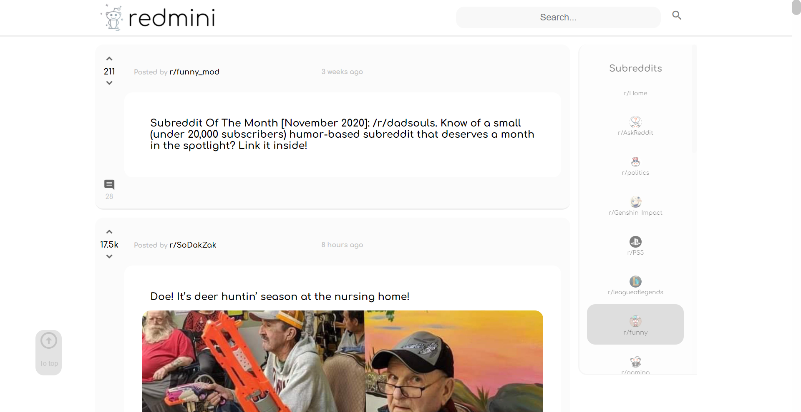
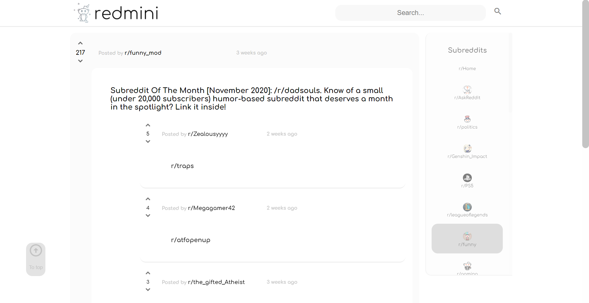
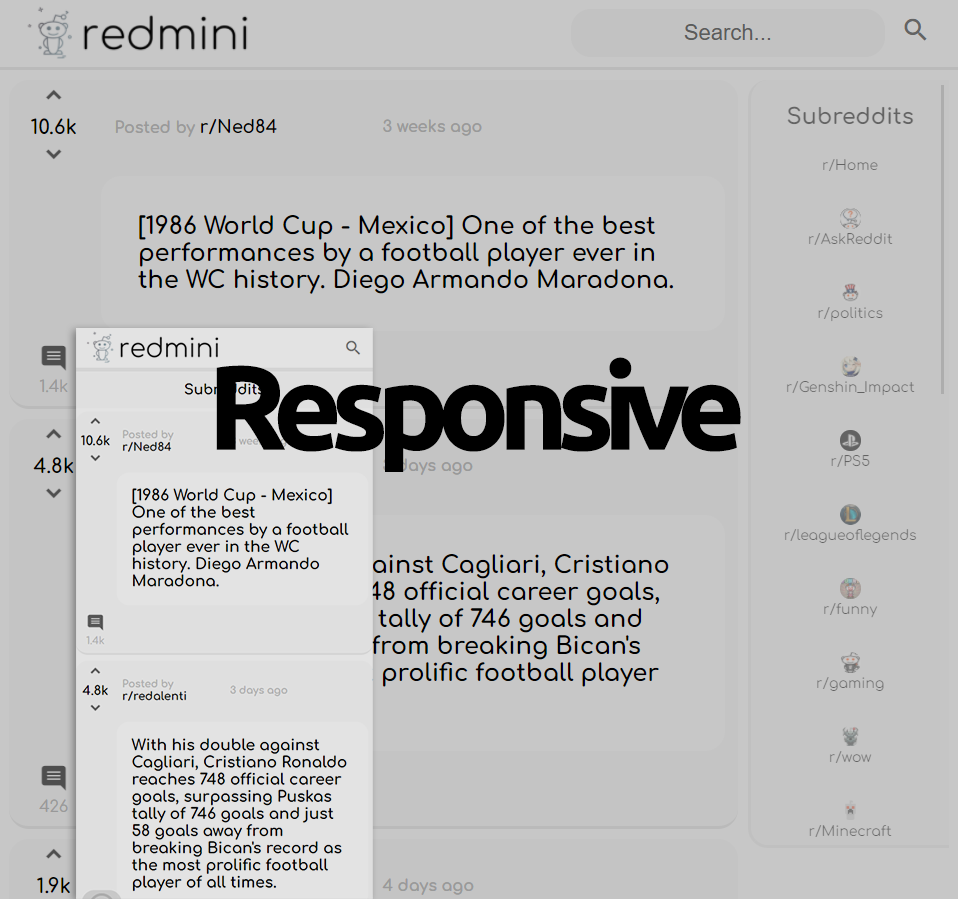

# Redmini - a mini app to read posts from Reddit

This is a portfolio project inspired by [Codecademy](https://www.codecademy.com/).\
I make this after taking the front-end course on the site. It is my very first web-app so it can have things to improve, and I will be please if you help me to make it better. Thank you very much!

## Preview

\
*First look of the web-app.*\
\
*When reading comments...*\
\
*And responsive in devices such as mobile or tablet.*

## Technologies used

This web-app was created with the help of following technologies:

- HTML
- CSS
- JavaScript
- React
- Redux
- Jest, Enzyme (testing)
- Git and GitHub (version control)

## Features

**Redmini** means **Red**dit in **mini**mal site!\
This web-app gives you the simplest features to interact with Reddit. With it you can search and read posts in categories.\
Redmini sticks with its name, which is focus on a mini UI, enough for you to read posts and comments from Reddit.\
Also, it works perfectly on multiple devices, from computer to mobile phone. Especially, in *Android*, you can just pin Redmini to main screen to make it a normal application.

## Future work

I am still working everyday to bring more features to Redmini without making it lost the major track: **minimal Reddit**.
